# 認証テスト

## OAuth Authentication Flow

```mermaid
sequenceDiagram
   actor User
   participant Browser
   participant AuthRoute as /routes/auth.[provider]/route.tsx
   participant CallbackRoute as /routes/auth.[provider].callback/route.tsx
   participant OAuthService as .server/auth/services/oauth.server.ts
   participant ProviderService as .server/auth/services/providers/[provider].server.ts
   participant DBService as .server/auth/services/oauth-db.server.ts
   participant OAuth as OAuth Provider
   participant DB as Database

   User->>Browser: ログインボタン押下
   Browser->>AuthRoute: POST /auth/[provider]
   AuthRoute->>OAuthService: createOAuthState()
   AuthRoute->>OAuthService: createOAuthParams()
   AuthRoute->>Browser: リダイレクト（OAuth認証画面へ）
   Browser->>OAuth: リダイレクト

   User->>OAuth: 認証・認可
   OAuth->>Browser: リダイレクト（コード付き）
   Browser->>CallbackRoute: GET /auth/[provider]/callback

   CallbackRoute->>OAuthService: state検証
   CallbackRoute->>ProviderService: getAccessToken()
   ProviderService->>OAuth: トークン取得リクエスト
   OAuth-->>ProviderService: アクセストークン
   ProviderService->>OAuth: ユーザー情報取得
   OAuth-->>ProviderService: ユーザー情報

   CallbackRoute->>DBService: findOrCreateOAuthUser()
   DBService->>DB: ユーザー検索
   DB-->>DBService: 検索結果
   alt ユーザーが存在しない
       DBService->>DB: ユーザー作成
       DB-->>DBService: 作成したユーザー
   else ユーザーが存在する
       alt アカウントリンクがない
           DBService->>DB: アカウント作成
           DB-->>DBService: 更新したユーザー
       end
   end

   CallbackRoute->>Browser: セッション作成＆ホームへリダイレクト
   Browser->>User: ログイン完了
```



## ファイル構成

- /routes/auth.[provider]/route.tsx: 認証初期処理
- /routes/auth.[provider].callback/route.tsx: コールバック処理
- .server/auth/services/oauth.server.ts: OAuth共通処理
- .server/auth/services/providers/[provider].server.ts: プロバイダー固有の実装
- .server/auth/services/oauth-db.server.ts: ユーザーのDB処理

Note: [provider] は google または line に置き換え。

---

# Welcome to Remix!

- 📖 [Remix docs](https://remix.run/docs)

## Development

Run the dev server:

```shellscript
npm run dev
```

## Deployment

First, build your app for production:

```sh
npm run build
```

Then run the app in production mode:

```sh
npm start
```

Now you'll need to pick a host to deploy it to.

### DIY

If you're familiar with deploying Node applications, the built-in Remix app server is production-ready.

Make sure to deploy the output of `npm run build`

- `build/server`
- `build/client`

## Styling

This template comes with [Tailwind CSS](https://tailwindcss.com/) already configured for a simple default starting experience. You can use whatever css framework you prefer. See the [Vite docs on css](https://vitejs.dev/guide/features.html#css) for more information.

---

## Setup (Local)

This setup guide is for my personal reference.

### 1. Install dependencies

```sh
npm install remix-auth remix-auth-form prisma @prisma/client bcryptjs
```

---

### 2. Set up PostgreSQL

Access the PostgreSQL container:

```sh
docker exec -it postgres_17_db_container psql -U postgres
```

Run the following SQL commands:

```postgresql
DROP DATABASE IF EXISTS zippi;
DROP USER IF EXISTS zippi;

CREATE USER zippi WITH SUPERUSER CREATEDB CREATEROLE PASSWORD 'zippi';

CREATE DATABASE zippi;
GRANT ALL PRIVILEGES ON DATABASE zippi TO zippi;

\c zippi
GRANT ALL PRIVILEGES ON SCHEMA public TO zippi;
ALTER DEFAULT PRIVILEGES IN SCHEMA public GRANT ALL ON TABLES TO zippi;
```

---

### 3. Run Prisma migrations

```sh
npx prisma migrate dev --name init
```

This will initialize your database schema for local development.
### 4. Install UI

For UI setup, refer to the official [shadcn UI installation guide for Remix](https://ui.shadcn.com/docs/installation/remix).

---

## Libraries

- **lucide-react / react-icons **: A collection of beautifully simple and consistent React icons.
